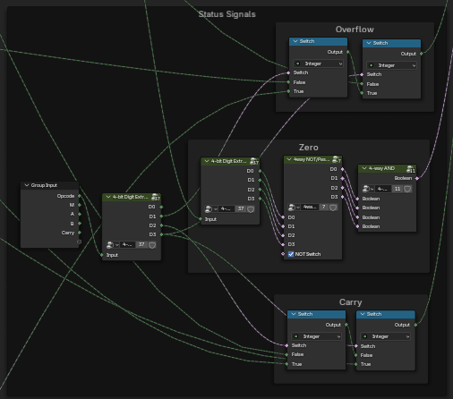

[Back](Arithmetic%20Logic%20Unit.md)

# Input

Our ALU takes in 5 bits of opcode. This is organized in one 4-bit number and a control bit, labeled M. This is just to keep it organized - many operations share a lot of circuitry, and M is the control node to switch between similar operations (e.g. Bitwise AND and Bitwise NAND).

Data-wise, my ALU takes in two 4-bit binary numbers, A and B. It will also take in one carry input, in order to allow ALUs to be potentially chained together.

# Output

In addition to the 4-bit data output, labeled Y, the ALU will also output status signals.

|Signal|Use|
|------|---|
|Carry-Out|Carry from addition operation, borrow from subtraction, or overflow from a binary shift|
|Zero|When all bits of Y are 0|
|Overflow|When arithmetic operation exceeds the numeric range of Y|

# Operation

Every function is wired into a set of multiplexers that select the corresponding functions based on the input opcode. Multiplexers are made using switch nodes. Two 8-1 multiplexers are wired together in order to account for all the functions. The multiplexers themselves are fairly straightforward 4-way AND and NOT nodes wired together.

# Functions

|Function|Description|Design Notes|
|--------|-----------|------------|
|Pass Through|Pass all bits through, no change||
|Add w/ Carry|Binary addition, produces a carry output.|Chaining full adders together. See [here](https://www.geeksforgeeks.org/digital-logic/binary-adder-with-logic-gates/)|
|Subtract w/ Borrow|Binary subtraction, slightly modified circuitry as the adder|Implements two's complement on B, so basically adds one number to the negative of the other. See [here](https://www.geeksforgeeks.org/digital-logic/4-bit-binary-adder-subtractor/)|
|Arithmetic Shift|Most significant digit is a "sign" digit and is preserved when shifting.|Left arithmetic shift is the same as left logical shift!|
|Logical Shift|Logical zero is the replacement bit.||
|Rotate|Treats the number as a loop, the digit that "goes off" in the shift is reinserted on the other side.||
|Rotate through Carry|Same as normal rotate, but the carry bit is included in the loop.||
|Increment|A or B is increased by 1.|Add 0001 from A or B|
|Decrement|A or B is decreased by 1.|Subtract 0001 from A or B|
|Bitwise NOT|Opposite of pass through, invert all bits.|Pair with pass through when choosing opcode-function pairings.|
|Bitwise AND|Every bit of output Y is AND of corresponding A and B bits.|Pair AND and NAND.|
|Bitwise NAND|Every bit of output Y is NAND of corresponding A and B bits.|Pair AND and NAND.|
|Bitwise OR|Every bit of output Y is OR of corresponding A and B bits.|Pair OR and NOR.|
|Bitwise NOR|Every bit of output Y is NOR of corresponding A and B bits.|Pair OR and NOR.|
|Bitwise XOR|Every bit of output Y is XOR of corresponding A and B bits.|Pair XOR and XNOR.|
|Bitwise XNOR|Every bit of output Y is XNOR of corresponding A and B bits.|Pair XOR and XNOR.|
|Two's Complement|A binary representation of negative numbers. The first bit is a sign bit.|Process - invert all bits, then add 1 to the entire inverted number, ignoring overflow. End result - leading digit is *subtracted*, all other digits added.|
|A > B, A \< B|Comparison functions.|Return the larger/smaller integer|
|A == B|Comparison functions.|Return 0001 if they're equal, otherwise 0000|
|Clear|Set all outputs of Y to 0.||
|Set|Set all outputs of Y to 1.||
