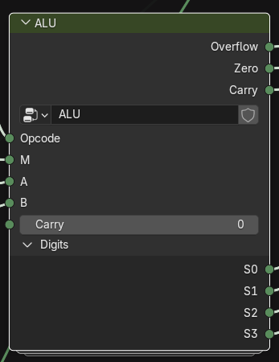
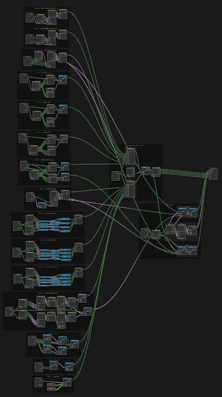

1. [ALU Operation](ALU%20Operation.md)
1. [Opcode](Opcode.md)
1. \[\[Home\]

 

# Specifications

|Inputs|Description|
|------|-----------|
|Opcode|4-bit binary value, determines the operation|
|M|1-bit control value, further specifies operation (left v. right, AND v. NAND, etc)|
|Carry (unused)|1-bit carry-value for binary addition or subtraction, unused in full CPU|
|A|4-bit binary operand|
|B|4-bit binary operand|
|**Outputs**|**Description**|
|S0-S3|1-bit digit values, where S0 is the rightmost digit and S3 is the leftmost|

# Description

Our arithmetic logic unit is a straightforward component to design. After associating opcodes with operations, we translate them all using Blender's logic gate nodes, and link them all to multiplexers to control the output. In fact, it's possible to take a real design and drop it in Blender 1:1, just by copying down the logic gates. For the sake of time and readability, our arithmetic logic unit is not the most optimized (by number of gates) as it could be.
