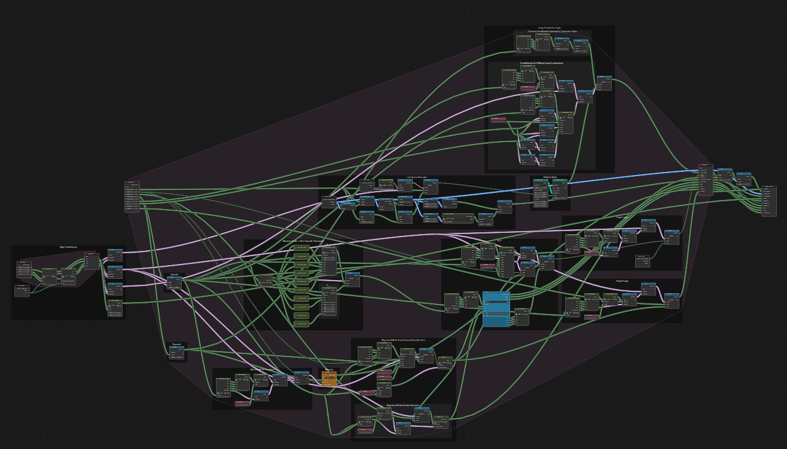

1. [Control Unit Operation](Control%20Unit%20Design.md)
2. [Instruction Set](Instruction%20Set.md)
3. [Home](..\README.md)

# Description

Our control unit is actually just the entire CPU rather than being a single distinct unit like a real CPU. This is due to the limitations introduced by Blender and the lack of two-way data transfer back and forth between nodes. It uses a two-bit counter to cycle through three states: decoding instructions, executing them, and jumping to different lines of code if necessary.

Programs are uploaded in the form of .txt files to a Blender node. A decoder checks line by line and translates the written code to binary, which is then fed into the rest of the system.
