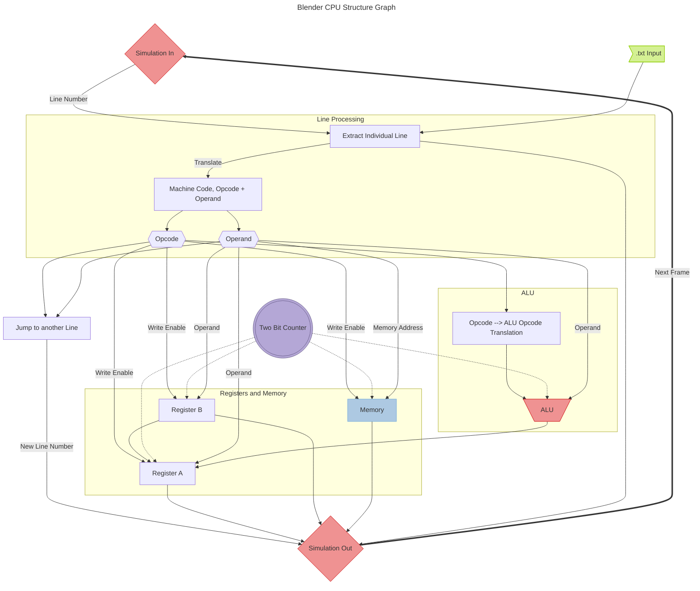

The objective of this project is to:
* Create a functioning 4-bit CPU in [Blender](https://www.blender.org/) using Geometry Nodes.
* Attempt to emulate real-world chip architecture strategies.
* Create a running program in this CPU

![[cpu_interface.png|416]]![[Pasted image 20260525163711.png|697]]
# Components
1. [[Arithmetic Logic Unit/Arithmetic Logic Unit.md]]
2. [[Memory]]
3. [[Control Unit]]
# CPU Architecture Basics
A CPU is made of several parts: a control unit, an arithmetic logic unit, and a memory unit.

A **control unit** synchronizes the CPUs operations to a clock circuit and coordinates data flow between the cache and the arithmetic logic unit. An **arithmetic logic unit (ALU)** handles arithmetic operations like addition and subtraction as well as logical ones. It is not synced to the clock; in a real CPU, the clock is set at a speed such that even at max propagation time, the ALU will still provide an output in time. In our case, clock speeds will be too low for propagation time to be a concern. Finally, a **memory unit** stores data and instructions.

A CPU executes four functions: fetch, decode, execute, and store. It fetches data from main memory, interprets those instructions, executes them, and sends data back to memory.

![[cpu_diagram.png]]
# Geometry Nodes
Geometry nodes are a system that allows us to modify the geometry of an object using a node-based interface. They can be used to create anything from fractals to procedural cities to landscapes. They support mathematical operations, logical operations, modifications of different data types like strings, integers, and Booleans, making them a powerful tool. This is our chosen medium to design a CPU.

The key feature that makes a CPU possible is the [**Simulation Node**](https://docs.blender.org/manual/en/latest/physics/simulation_nodes.html). This node uses the results of the previous frame in calculations for the next one, allowing for recursive operations. 

![[sim_zone.png]]

Within the simulation zone, parameters are recalculated every frame. This is *essential* for the design of a CPU. Something as simple as a flip-flop is not possible without this node, and neither is, for example, a register. Even so, there are some limitations and quirks that this medium introduces.
# How Will it Translate?
The largest difference with this medium is that we do not have a control unit that interfaces with the other units of the CPU. Blender does not support this kind of back-and-forth structure. Instead, we need to use one massive simulation zone encompassing the entire thing, where many parameters are continually recalculated in a cycle (see diagram below).

Also, Blender does not support loops if they are not attached to a simulation zone. Making a counter with D-Flip-flops is far more cumbersome and requires nested zones, as the output needs to be fed back into the input for a D-Flip-flop counter. Similarly, designing conventional memory with AND-OR latches is tough. Luckily, workarounds exist for these issues.

We link our clock to the frame number in Blender. It has been designed with a full clock cycle of 20 frames, although this can be decreased. The theoretical minimum is a 4 frame full clock cycle, as some operations have 1 frame delays by necessity (analogous to propagation time in a real circuit).

Our CPU will still process data in binary, but Blender doesn't have an in-built base 2 mode. We frequently convert the individual digits of a number into a single integer to simplify wiring. Things like the memory address is designed with base 10, so any base 2 input needs to be converted first.

Finally, we have a 3-state cycle instead of a 4-state (fetch, decode, execute, store) like you'd see on a conventional CPU. The first state controls the instruction decoding and translation, the second state triggers all instruction executions, and the final state controls the jump instructions.

# Our Design

The entire setup is enclosed within one set of simulation nodes. Whenever something needs to be transferred "backwards", like moving a value in memory to Register A or by moving a value in Register A to the ALU, it goes to the simulation output node and loops back to the simulation input node on the next frame. This solves the limitation of not having bidirectional flow in geometry nodes; without the simulation node, data cannot be moved back and forth.

A .txt input file is fed into a node setup that extracts a line based on a stored line index (this could be analogous to an internal register that stores the instruction number). Then, that line is translated to machine code, split into opcode and operand, and sent to a destination based on the instruction. A two-bit counter (counts from 0-2 and resets, 3 states) controls the timing of execution of instructions.

There is also logic to jump to another line, which is achieved by overriding the stored line index (which normally iterates up by 1 every instruction) and changing it to one the user specifies.

# I/O
Input is controlled by the position of a set of axes which the user can move. The current setup allows for four possible inputs - 1000, 0100, 0010, and 0001. However, this is a modular setup and is a different node. The input in the CPU itself allows for any 4-bit binary integer to be inputted, so the user could change this. The program is loaded in from a text file.

![[cpu_inputoutput.png]]

![[cpu_input.png]]

Output is just a 4-bit binary number. It is possible, again, to create an external module to associate that 4-bit number with some visual representation. However, the current setup does not implement this. Along with the main output are a series of status outputs that show the inner workings of the CPU.
