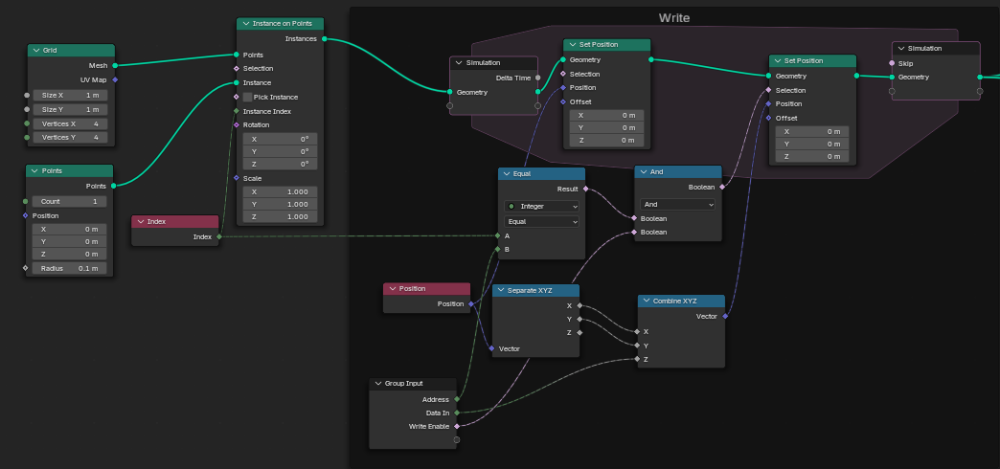
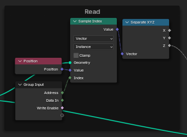

---
---
[Back](Memory.md)

# Structure

Our memory uses points instantiated on the vertices of the grid node. The positions of these vertices can be individually accessed, manipulated, and retrieved using an index, allowing us to store large quantities of scalable information.

We write data by checking if the input address value is equal to the index, and further checking if write is enabled. Then we can set the Z-value of that individual instance. This process is not synced to a clock - instead, the write-enable wiring *outside* the memory module is synced to a clock.

Reading data is simple. We just sample the position of the instance using the same index input of the whole memory node.

